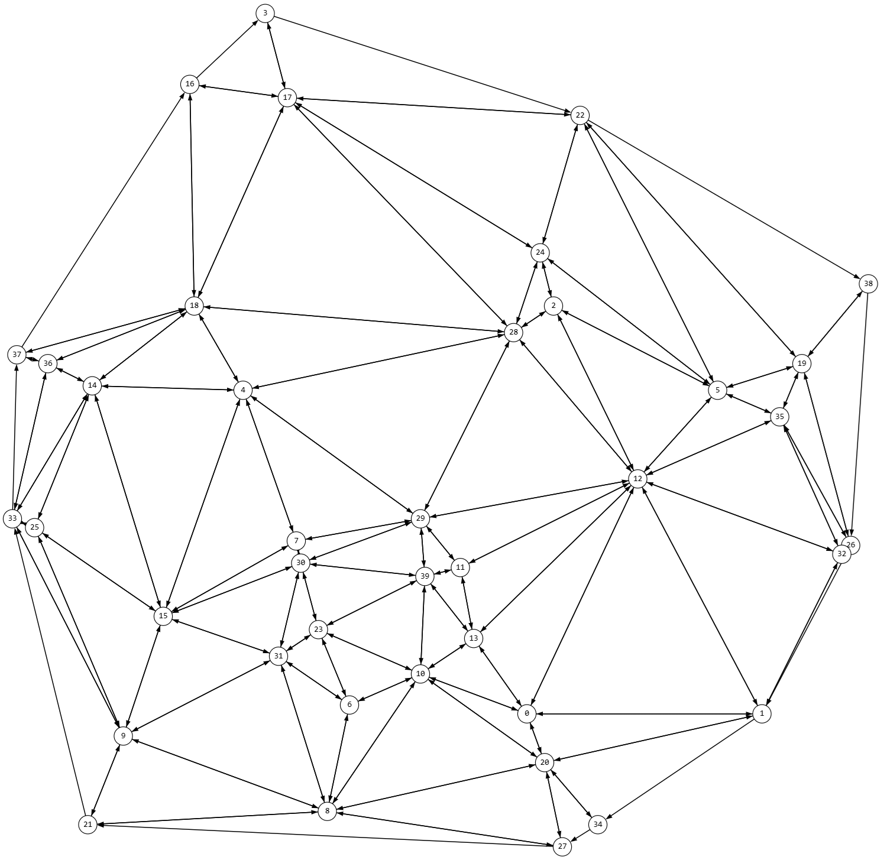
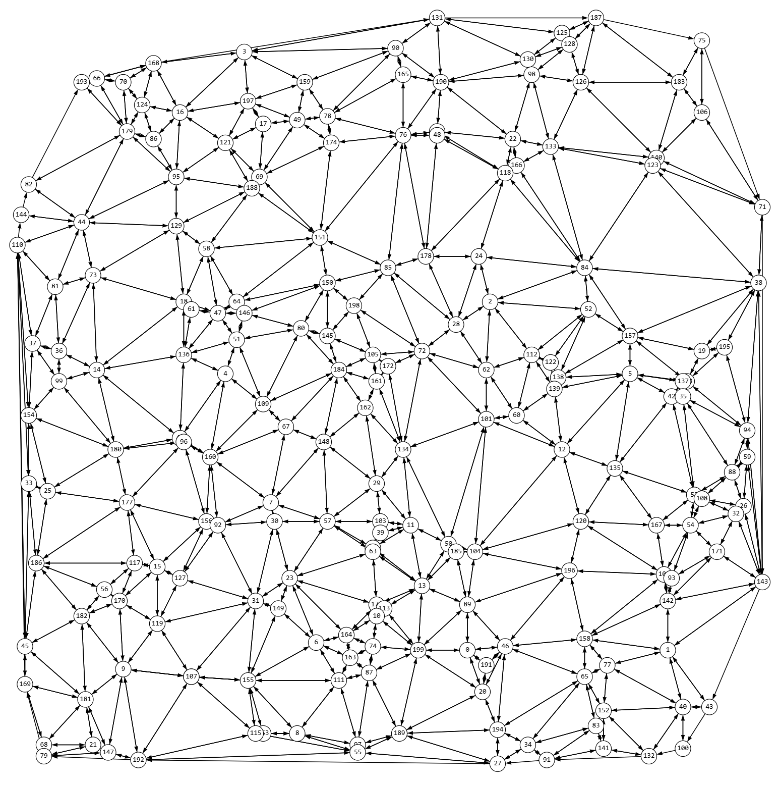
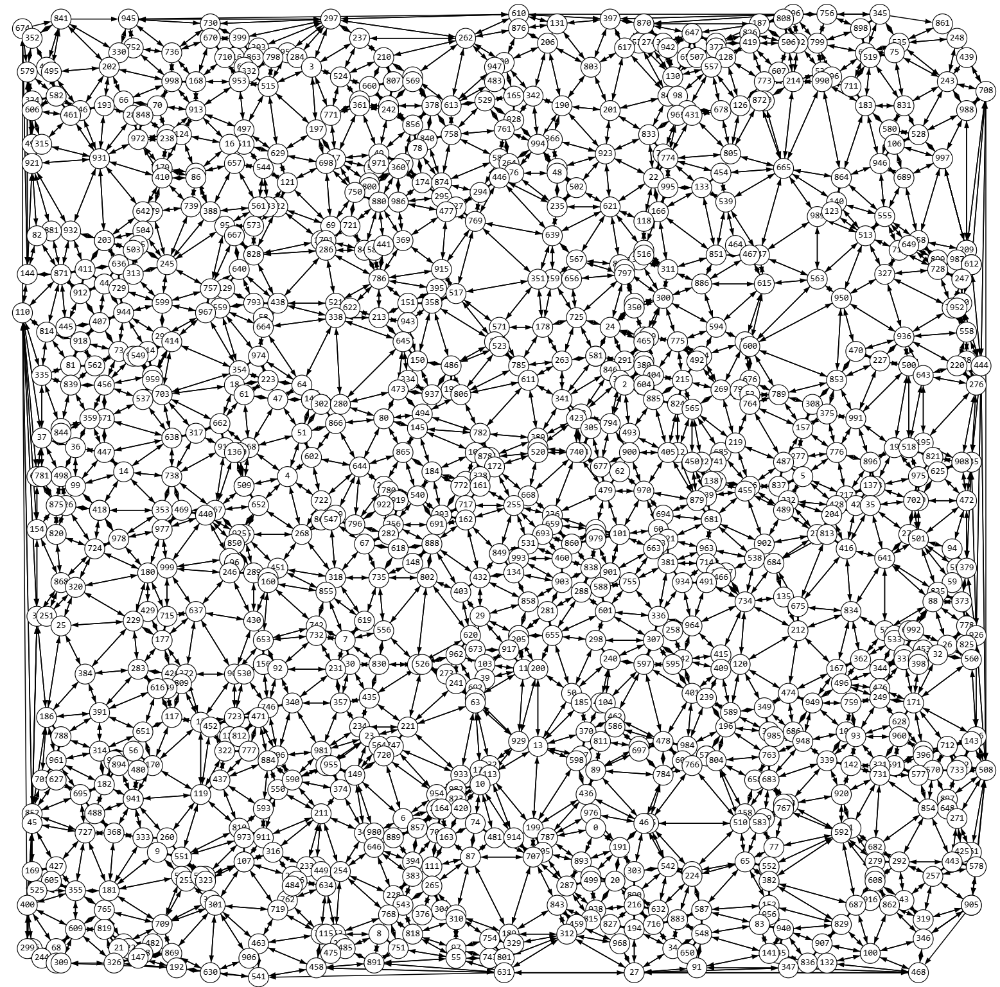
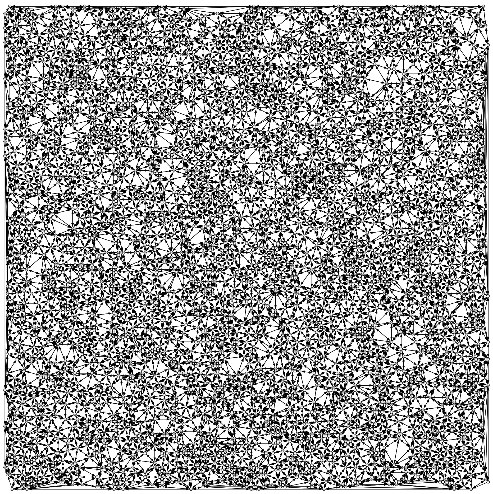

# delauney-triangulation-div-conq
Delauney triangulation using divide&amp;conquer-type algorithm, $\textrm{O}(N \textrm{log}(N))$ computational efficiency in worst and average cases.

THE CODE IS NOT CHECKED THOROUGHFULLY and is posted as an unfinished training project. It may possess memory leaks etc. To be fixed.

## Results:

## How it works: 
1. Area is divided in vertical stripes. In each of them Delauney triangulation is built simply adding points one by one from a vertically sorted array ( $O(N)$ ). 

2. After the triangulation on a stripe is ready, it is made convex while traversing nodes on free edges. Triangulation of stripes is done sequentally, but the process is fully parallelizable by stripes as stripes are not dependent on each other. 

3. Stripes are merged with filling inner area algorithm, traversing free edges of stripes. 

4. The resulting configuration is checked for Delauney criterium triangle by triangle until the condition is met by the whole triangulation. This could be accelerated with labeling flipped triangles and rechecking the surrounding ones after flip, but it is left for future improvements.

## How to view results:
`main.cpp` provides a way to output the triangulation. Just use `.print("filename")` function for triangulation. Then go to `https://programforyou.ru/graph-redactor` and click "Создать граф" (Create graph) on a panel to the left; then click "Загрузить из файла" (Download from file).

The output was made only for quick testing purpose and that is why it involves using third-party web resourses.

## NBs:
- If Delauney triangulation for a stripe cannot be built, stripe size is divided by two and the process repeats.
- Oriented triangles are used in triangulation, orientation is counterclockwise. Inner edges are doubled (have twins, edge A->B has a twin B->A), free edges do not have twins.
- Triangulation may appear to be non-convex. // TOFIX
- Triangulation parts may be sewed weirdly. // TOFIX
- If input points are too close, the success is not guaranteed as the algorithm lacks tolerances usage.

## References:
AV Skvortsov's book on Delauney triangulation algorithms: https://indorsoft.ru/books/2002/SkvortsovAV-2002-01.Book(Trn).pdf
